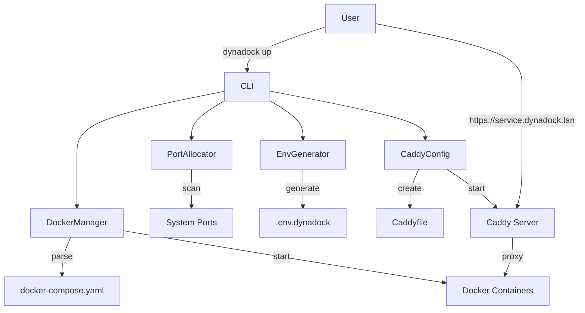

# DynaDock - Complete Tests & Documentation

## Makefile

```makefile
# DynaDock Makefile
.PHONY: help install dev test lint format docs clean docker-test release

PYTHON := python3
UV := uv
PROJECT_NAME := dynadock
VERSION := $(shell grep version pyproject.toml | head -1 | cut -d'"' -f2)

# Colors for output
BLUE := \033[0;34m
GREEN := \033[0;32m
YELLOW := \033[0;33m
RED := \033[0;31m
NC := \033[0m # No Color

help: ## Show this help message
	@echo "$(BLUE)DynaDock Development Commands$(NC)"
	@echo ""
	@grep -E '^[a-zA-Z_-]+:.*?## .*$$' $(MAKEFILE_LIST) | sort | awk 'BEGIN {FS = ":.*?## "}; {printf "$(GREEN)%-20s$(NC) %s\n", $$1, $$2}'

install: ## Install production dependencies
	@echo "$(YELLOW)Installing DynaDock...$(NC)"
	$(UV) pip install -e .
	@echo "$(GREEN)✓ Installation complete$(NC)"

dev: ## Install development dependencies
	@echo "$(YELLOW)Setting up development environment...$(NC)"
	$(UV) pip install -e ".[dev]"
	$(UV) pip install pytest pytest-cov pytest-asyncio pytest-docker black ruff mypy
	@echo "$(GREEN)✓ Development environment ready$(NC)"

test: ## Run all tests
	@echo "$(YELLOW)Running tests...$(NC)"
	$(UV) run pytest tests/ -v --cov=src/dynadock --cov-report=term-missing --cov-report=html
	@echo "$(GREEN)✓ Tests complete$(NC)"

test-unit: ## Run unit tests only
	@echo "$(YELLOW)Running unit tests...$(NC)"
	$(UV) run pytest tests/unit/ -v

test-integration: ## Run integration tests only
	@echo "$(YELLOW)Running integration tests...$(NC)"
	$(UV) run pytest tests/integration/ -v -m integration

test-watch: ## Run tests in watch mode
	$(UV) run pytest-watch tests/ -v

lint: ## Run linting checks
	@echo "$(YELLOW)Running linters...$(NC)"
	$(UV) run ruff check src/ tests/
	$(UV) run mypy src/dynadock --ignore-missing-imports
	@echo "$(GREEN)✓ Linting complete$(NC)"

format: ## Format code with black and ruff
	@echo "$(YELLOW)Formatting code...$(NC)"
	$(UV) run black src/ tests/
	$(UV) run ruff check --fix src/ tests/
	@echo "$(GREEN)✓ Formatting complete$(NC)"

docs: ## Build documentation
	@echo "$(YELLOW)Building documentation...$(NC)"
	cd docs && $(UV) run mkdocs build
	@echo "$(GREEN)✓ Documentation built in docs/site/$(NC)"

docs-serve: ## Serve documentation locally
	@echo "$(YELLOW)Serving documentation at http://localhost:8000$(NC)"
	cd docs && $(UV) run mkdocs serve

clean: ## Clean build artifacts
	@echo "$(YELLOW)Cleaning build artifacts...$(NC)"
	rm -rf build/ dist/ *.egg-info .coverage htmlcov/ .pytest_cache/
	rm -rf .dynadock/ .env.dynadock
	find . -type d -name __pycache__ -exec rm -rf {} + 2>/dev/null || true
	find . -type f -name "*.pyc" -delete
	@echo "$(GREEN)✓ Clean complete$(NC)"

docker-test: ## Test with real Docker environment
	@echo "$(YELLOW)Running Docker integration tests...$(NC)"
	docker-compose -f tests/fixtures/docker-compose.test.yaml up -d
	$(UV) run pytest tests/integration/ -v -m docker
	docker-compose -f tests/fixtures/docker-compose.test.yaml down -v

security: ## Run security checks
	@echo "$(YELLOW)Running security checks...$(NC)"
	$(UV) pip install bandit safety
	$(UV) run bandit -r src/dynadock
	$(UV) run safety check
	@echo "$(GREEN)✓ Security checks complete$(NC)"

release: ## Create a new release
	@echo "$(YELLOW)Creating release $(VERSION)...$(NC)"
	git tag -a v$(VERSION) -m "Release version $(VERSION)"
	git push origin v$(VERSION)
	$(UV) build
	@echo "$(GREEN)✓ Release $(VERSION) created$(NC)"

docker-build: ## Build Docker image for DynaDock
	@echo "$(YELLOW)Building Docker image...$(NC)"
	docker build -t dynadock:$(VERSION) -t dynadock:latest .
	@echo "$(GREEN)✓ Docker image built$(NC)"

pre-commit: format lint test ## Run all checks before commit
	@echo "$(GREEN)✓ Ready to commit!$(NC)"

coverage-report: ## Generate and open coverage report
	@echo "$(YELLOW)Generating coverage report...$(NC)"
	$(UV) run pytest tests/ --cov=src/dynadock --cov-report=html
	open htmlcov/index.html || xdg-open htmlcov/index.html

benchmark: ## Run performance benchmarks
	@echo "$(YELLOW)Running benchmarks...$(NC)"
	$(UV) run pytest tests/benchmarks/ -v --benchmark-only

check-deps: ## Check for outdated dependencies
	@echo "$(YELLOW)Checking dependencies...$(NC)"
	$(UV) pip list --outdated

update-deps: ## Update all dependencies
	@echo "$(YELLOW)Updating dependencies...$(NC)"
	$(UV) pip install --upgrade pip
	$(UV) pip install -e . --upgrade

.DEFAULT_GOAL := help
```

## pytest.ini

```ini
[pytest]
minversion = 7.0
testpaths = tests
python_files = test_*.py
python_classes = Test*
python_functions = test_*

# Markers
markers =
    unit: Unit tests
    integration: Integration tests requiring Docker
    docker: Tests requiring Docker daemon
    slow: Slow running tests
    network: Tests requiring network access

# Coverage
addopts = 
    -ra
    --strict-markers
    --strict-config
    --cov=src/dynadock
    --cov-branch
    --cov-report=term-missing:skip-covered
    --cov-report=html
    --cov-report=xml
    --cov-fail-under=80

# Logging
log_cli = true
log_cli_level = INFO
log_cli_format = %(asctime)s [%(levelname)8s] %(name)s - %(message)s
log_cli_date_format = %Y-%m-%d %H:%M:%S

# Asyncio
asyncio_mode = auto

# Warnings
filterwarnings =
    error
    ignore::UserWarning
    ignore::DeprecationWarning
```

## .gitignore

```gitignore
# Python
__pycache__/
*.py[cod]
*$py.class
*.so
.Python
env/
venv/
ENV/
build/
develop-eggs/
dist/
downloads/
eggs/
.eggs/
lib/
lib64/
parts/
sdist/
var/
wheels/
*.egg-info/
.installed.cfg
*.egg
MANIFEST

# Testing
.coverage
.pytest_cache/
htmlcov/
.tox/
.hypothesis/
*.cover
.coverage.*

# DynaDock specific
.dynadock/
.env.dynadock
.dynadock-compose.yaml
*.log

# IDE
.vscode/
.idea/
*.swp
*.swo
*~
.DS_Store

# Documentation
docs/site/
*.pdf

# Docker
.dockerignore
docker-compose.override.yml
```

## tests/conftest.py

```python
"""Pytest configuration and fixtures."""

import os
import sys
import pytest
import tempfile
import shutil
from pathlib import Path
from unittest.mock import Mock, patch
import docker
import yaml

# Add src to path
sys.path.insert(0, os.path.join(os.path.dirname(__file__), '..', 'src'))

@pytest.fixture
def temp_dir():
    """Create a temporary directory for testing."""
    temp_dir = tempfile.mkdtemp()
    yield Path(temp_dir)
    shutil.rmtree(temp_dir)

@pytest.fixture
def mock_docker_client():
    """Mock Docker client."""
    with patch('docker.from_env') as mock:
        client = Mock()
        mock.return_value = client
        yield client

@pytest.fixture
def sample_compose_file(temp_dir):
    """Create a sample docker-compose.yaml file."""
    compose_content = {
        'version': '3.8',
        'services': {
            'api': {
                'image': 'node:18',
                'ports': ['3000:3000'],
                'environment': {
                    'NODE_ENV': 'production'
                }
            },
            'postgres': {
                'image': 'postgres:15',
                'environment': {
                    'POSTGRES_PASSWORD': 'password'
                },
                'volumes': ['postgres_data:/var/lib/postgresql/data']
            },
            'redis': {
                'image': 'redis:7',
                'ports': ['6379']
            }
        },
        'volumes': {
            'postgres_data': {}
        }
    }
    
    compose_file = temp_dir / 'docker-compose.yaml'
    with open(compose_file, 'w') as f:
        yaml.dump(compose_content, f)
    
    return compose_file

@pytest.fixture
def mock_port_allocator():
    """Mock PortAllocator."""
    with patch('dynadock.port_allocator.PortAllocator') as mock:
        allocator = Mock()
        allocator.get_free_port.side_effect = [8001, 8002, 8003, 8004, 8005]
        mock.return_value = allocator
        yield allocator

@pytest.fixture
def env_file(temp_dir):
    """Create temporary env file path."""
    return temp_dir / '.env.dynadock'

@pytest.fixture
def mock_subprocess():
    """Mock subprocess calls."""
    with patch('subprocess.run') as mock:
        mock.return_value = Mock(returncode=0, stdout='', stderr='')
        yield mock

@pytest.fixture(scope='session')
def docker_client():
    """Real Docker client for integration tests."""
    try:
        client = docker.from_env()
        client.ping()
        return client
    except:
        pytest.skip("Docker not available")

@pytest.fixture
def cleanup_docker(docker_client):
    """Cleanup Docker resources after tests."""
    containers = []
    networks = []
    volumes = []
    
    yield {
        'containers': containers,
        'networks': networks,
        'volumes': volumes
    }
    
    # Cleanup
    for container in containers:
        try:
            c = docker_client.containers.get(container)
            c.stop()
            c.remove(force=True)
        except:
            pass
    
    for network in networks:
        try:
            n = docker_client.networks.get(network)
            n.remove()
        except:
            pass
    
    for volume in volumes:
        try:
            v = docker_client.volumes.get(volume)
            v.remove(force=True)
        except:
            pass
```

## tests/unit/test_port_allocator.py

```python
"""Unit tests for PortAllocator."""

import pytest
from unittest.mock import patch, Mock
import socket

from dynadock.port_allocator import PortAllocator


class TestPortAllocator:
    """Test PortAllocator functionality."""
    
    def test_init(self):
        """Test PortAllocator initialization."""
        allocator = PortAllocator(8000, 9000)
        assert allocator.start_port == 8000
        assert allocator.end_port == 9000
        assert isinstance(allocator.allocated_ports, set)
    
    @patch('psutil.net_connections')
    def test_scan_used_ports(self, mock_connections):
        """Test scanning for used ports."""
        # Mock psutil connections
        mock_conn1 = Mock()
        mock_conn1.laddr = Mock(port=8080)
        mock_conn2 = Mock()
        mock_conn2.laddr = Mock(port=3000)
        mock_connections.return_value = [mock_conn1, mock_conn2]
        
        allocator = PortAllocator()
        assert 8080 in allocator.allocated_ports
        assert 3000 in allocator.allocated_ports
    
    def test_is_port_free_allocated(self):
        """Test checking if allocated port is free."""
        allocator = PortAllocator()
        allocator.allocated_ports.add(8080)
        assert not allocator.is_port_free(8080)
    
    @patch('socket.socket')
    def test_is_port_free_socket_error(self, mock_socket_class):
        """Test port check with socket error."""
        mock_socket = Mock()
        mock_socket.__enter__ = Mock(return_value=mock_socket)
        mock_socket.__exit__ = Mock(return_value=None)
        mock_socket.bind.side_effect = socket.error()
        mock_socket_class.return_value = mock_socket
        
        allocator = PortAllocator()
        assert not allocator.is_port_free(8080)
    
    @patch('socket.socket')
    def test_is_port_free_success(self, mock_socket_class):
        """Test successful port check."""
        mock_socket = Mock()
        mock_socket.__enter__ = Mock(return_value=mock_socket)
        mock_socket.__exit__ = Mock(return_value=None)
        mock_socket.bind.return_value = None
        mock_socket_class.return_value = mock_socket
        
        allocator = PortAllocator()
        assert allocator.is_port_free(8080)
    
    @patch.object(PortAllocator, 'is_port_free')
    def test_get_free_port(self, mock_is_free):
        """Test getting a free port."""
        mock_is_free.side_effect = [False, False, True]
        
        allocator = PortAllocator(8000, 8100)
        port = allocator.get_free_port()
        
        assert port == 8002
        assert port in allocator.allocated_ports
    
    @patch.object(PortAllocator, 'is_port_free')
    def test_get_free_port_none_available(self, mock_is_free):
        """Test when no free ports are available."""
        mock_is_free.return_value = False
        
        allocator = PortAllocator(8000, 8001)
        
        with pytest.raises(Exception, match="No free ports available"):
            allocator.get_free_port()
    
    def test_release_port(self):
        """Test releasing an allocated port."""
        allocator = PortAllocator()
        allocator.allocated_ports.add(8080)
        
        allocator.release_port(8080)
        assert 8080 not in allocator.allocated_ports
        
        # Releasing non-allocated port should not error
        allocator.release_port(9999)
```

## tests/unit/test_docker_manager.py

```python
"""Unit tests for DockerManager."""

import pytest
from unittest.mock import Mock, patch, mock_open
from pathlib import Path
import yaml

from dynadock.docker_manager import DockerManager


class TestDockerManager:
    """Test DockerManager functionality."""
    
    def test_init(self, temp_dir, mock_docker_client):
        """Test DockerManager initialization."""
        compose_file = temp_dir / 'docker-compose.yaml'
        compose_file.touch()
        
        manager = DockerManager(str(compose_file), temp_dir)
        
        assert manager.compose_file == str(compose_file)
        assert manager.project_dir == temp_dir
        assert manager.project_name == temp_dir.name.lower().replace('_', '').replace('-', '')
    
    def test_get_project_name(self, temp_dir, mock_docker_client):
        """Test project name generation."""
        temp_dir = Path('/tmp/My_Test-Project')
        manager = DockerManager('compose.yaml', temp_dir)
        
        assert manager._get_project_name() == 'mytestproject'
    
    def test_parse_compose(self, sample_compose_file, mock_docker_client):
        """Test parsing docker-compose.yaml."""
        manager = DockerManager(str(sample_compose_file), sample_compose_file.parent)
        services = manager.parse_compose()
        
        assert 'api' in services
        assert 'postgres' in services
        assert 'redis' in services
        assert services['api']['image'] == 'node:18'
    
    @patch('dynadock.port_allocator.PortAllocator')
    def test_allocate_ports(self, mock_allocator_class, sample_compose_file, mock_docker_client):
        """Test port allocation for services."""
        mock_allocator = Mock()
        mock_allocator.get_free_port.side_effect = [8001, 8002]
        mock_allocator_class.return_value = mock_allocator
        
        manager = DockerManager(str(sample_compose_file), sample_compose_file.parent)
        services = manager.parse_compose()
        ports = manager.allocate_ports(services, 8000)
        
        assert ports['api'] == 8001
        assert ports['redis'] == 8002
        assert 'postgres' not in ports  # No ports exposed
    
    @patch('subprocess.run')
    def test_up_success(self, mock_run, sample_compose_file, mock_docker_client):
        """Test starting services successfully."""
        mock_run.return_value = Mock(returncode=0, stderr='')
        mock_docker_client.containers.list.return_value = []
        
        manager = DockerManager(str(sample_compose_file), sample_compose_file.parent)
        env_vars = {'TEST': 'value'}
        
        containers = manager.up(env_vars, detach=True)
        
        mock_run.assert_called_once()
        call_args = mock_run.call_args
        
        # Check command
        cmd = call_args[0][0]
        assert 'docker-compose' in cmd
        assert '-f' in cmd
        assert 'up' in cmd
        assert '-d' in cmd
        
        # Check environment
        assert call_args[1]['env']['TEST'] == 'value'
    
    @patch('subprocess.run')
    def test_up_failure(self, mock_run, sample_compose_file, mock_docker_client):
        """Test handling of startup failure."""
        mock_run.return_value = Mock(returncode=1, stderr='Error starting services')
        
        manager = DockerManager(str(sample_compose_file), sample_compose_file.parent)
        
        with pytest.raises(Exception, match="Failed to start services"):
            manager.up({})
    
    @patch('subprocess.run')
    def test_down(self, mock_run, sample_compose_file, mock_docker_client):
        """Test stopping services."""
        manager = DockerManager(str(sample_compose_file), sample_compose_file.parent)
        
        manager.down(remove_volumes=True, remove_images=True)
        
        mock_run.assert_called_once()
        cmd = mock_run.call_args[0][0]
        
        assert 'docker-compose' in cmd
        assert 'down' in cmd
        assert '-v' in cmd
        assert '--rmi' in cmd
        assert 'all' in cmd
    
    def test_ps(self, sample_compose_file, mock_docker_client):
        """Test listing containers."""
        mock_container = Mock()
        mock_docker_client.containers.list.return_value = [mock_container]
        
        manager = DockerManager(str(sample_compose_file), sample_compose_file.parent)
        containers = manager.ps()
        
        assert len(containers) == 1
        assert containers[0] == mock_container
        
        # Check filter
        call_args = mock_docker_client.containers.list.call_args
        filters = call_args[1]['filters']
        assert 'label' in filters
    
    @patch('subprocess.run')
    def test_logs(self, mock_run, sample_compose_file, mock_docker_client):
        """Test getting logs."""
        manager = DockerManager(str(sample_compose_file), sample_compose_file.parent)
        
        manager.logs(service='api', follow=False)
        
        mock_run.assert_called_once()
        cmd = mock_run.call_args[0][0]
        
        assert 'docker-compose' in cmd
        assert 'logs' in cmd
        assert 'api' in cmd
    
    @patch('subprocess.run')
    def test_exec(self, mock_run, sample_compose_file, mock_docker_client):
        """Test executing command in container."""
        manager = DockerManager(str(sample_compose_file), sample_compose_file.parent)
        
        manager.exec('api', '/bin/bash')
        
        mock_run.assert_called_once()
        cmd = mock_run.call_args[0][0]
        
        assert 'docker-compose' in cmd
        assert 'exec' in cmd
        assert 'api' in cmd
        assert '/bin/bash' in cmd
```

## tests/unit/test_env_generator.py

```python
"""Unit tests for EnvGenerator."""

import pytest
from pathlib import Path
import secrets
from unittest.mock import patch, mock_open

from dynadock.env_generator import EnvGenerator


class TestEnvGenerator:
    """Test EnvGenerator functionality."""
    
    def test_init(self, temp_dir):
        """Test EnvGenerator initialization."""
        env_file = temp_dir / '.env.test'
        generator = EnvGenerator(str(env_file))
        
        assert generator.env_file == env_file
    
    @patch('secrets.token_urlsafe')
    def test_generate_basic(self, mock_token, temp_dir):
        """Test basic environment variable generation."""
        mock_token.side_effect = ['secret1', 'secret2', 'pass1', 'pass2', 'pass3']
        
        env_file = temp_dir / '.env.test'
        generator = EnvGenerator(str(env_file))
        
        services = {
            'api': {'image': 'node:18'},
            'frontend': {'image': 'nginx'}
        }
        ports = {'api': 8001, 'frontend': 8002}
        
        env_vars = generator.generate(
            services=services,
            ports=ports,
            domain='test.local',
            enable_tls=True,
            cors_origins=['http://localhost:3000']
        )
        
        # Check basic variables
        assert env_vars['DYNADOCK_DOMAIN'] == 'test.local'
        assert env_vars['DYNADOCK_PROTOCOL'] == 'https'
        assert env_vars['DYNADOCK_ENABLE_TLS'] == 'true'
        
        # Check service variables
        assert env_vars['API_PORT'] == '8001'
        assert env_vars['API_HOST'] == '0.0.0.0'
        assert env_vars['API_URL'] == 'https://api.test.local'
        assert env_vars['API_INTERNAL_URL'] == 'http://api:8001'
        
        assert env_vars['FRONTEND_PORT'] == '8002'
        assert env_vars['FRONTEND_URL'] == 'https://frontend.test.local'
        
        # Check secrets
        assert env_vars['DYNADOCK_SECRET_KEY'] == 'secret1'
        assert env_vars['DYNADOCK_JWT_SECRET'] == 'secret2'
        
        # Check file was written
        assert env_file.exists()
    
    @patch('secrets.token_urlsafe')
    def test_generate_with_database(self, mock_token, temp_dir):
        """Test generation with database services."""
        mock_token.return_value = 'testpass'
        
        generator = EnvGenerator(str(temp_dir / '.env.test'))
        
        services = {
            'postgres': {'image': 'postgres:15'},
            'mysql': {'image': 'mysql:8'},
            'mongodb': {'image': 'mongo:6'},
            'redis': {'image': 'redis:7'}
        }
        ports = {
            'postgres': 5432,
            'mysql': 3306,
            'mongodb': 27017,
            'redis': 6379
        }
        
        env_vars = generator.generate(
            services=services,
            ports=ports,
            domain='test.local',
            enable_tls=False,
            cors_origins=[]
        )
        
        # Check PostgreSQL
        assert 'POSTGRES_USER' in env_vars
        assert 'POSTGRES_PASSWORD' in env_vars
        assert 'POSTGRES_DB' in env_vars
        assert 'POSTGRES_DSN' in env_vars
        assert 'postgresql://' in env_vars['POSTGRES_DSN']
        
        # Check MySQL
        assert 'MYSQL_USER' in env_vars
        assert 'MYSQL_PASSWORD' in env_vars
        assert 'MYSQL_DATABASE' in env_vars
        assert 'MYSQL_DSN' in env_vars
        assert 'mysql://' in env_vars['MYSQL_DSN']
        
        # Check MongoDB
        assert 'MONGODB_USER' in env_vars
        assert 'MONGODB_PASSWORD' in env_vars
        assert 'MONGODB_URI' in env_vars
        assert 'mongodb://' in env_vars['MONGODB_URI']
        
        # Check Redis
        assert 'REDIS_PASSWORD' in env_vars
        assert 'REDIS_URL' in env_vars
        assert 'redis://' in env_vars['REDIS_URL']
    
    def test_cors_origins_default(self, temp_dir):
        """Test default CORS origins."""
        generator = EnvGenerator(str(temp_dir / '.env.test'))
        
        env_vars = generator.generate(
            services={},
            ports={},
            domain='app.local',
            enable_tls=False,
            cors_origins=[]
        )
        
        cors = env_vars['DYNADOCK_CORS_ORIGINS']
        assert 'http://localhost:3000' in cors
        assert 'http://localhost:5173' in cors
        assert 'https://*.app.local' in cors
    
    def test_cors_origins_custom(self, temp_dir):
        """Test custom CORS origins."""
        generator = EnvGenerator(str(temp_dir / '.env.test'))
        
        env_vars = generator.generate(
            services={},
            ports={},
            domain='app.local',
            enable_tls=False,
            cors_origins=['https://app.com', 'https://api.app.com']
        )
        
        cors = env_vars['DYNADOCK_CORS_ORIGINS']
        assert cors == 'https://app.com,https://api.app.com'
    
    def test_write_env_file(self, temp_dir):
        """Test writing environment file."""
        env_file = temp_dir / '.env.test'
        generator = EnvGenerator(str(env_file))
        
        env_vars = {
            'DYNADOCK_DOMAIN': 'test.local',
            'API_PORT': '8000',
            'SECRET_KEY': 'secret',
            'DB_DSN': 'postgresql://...'
        }
        
        generator._write_env_file(env_vars)
        
        assert env_file.exists()
        content = env_file.read_text()
        
        # Check header
        assert '# Generated by DynaDock' in content
        assert '# DO NOT EDIT MANUALLY' in content
        
        # Check grouping
        assert '# General' in content
        assert '# Services' in content
        assert '# Security' in content
        assert '# Database' in content
        
        # Check variables
        assert 'DYNADOCK_DOMAIN=test.local' in content
        assert 'API_PORT=8000' in content
        assert 'SECRET_KEY=secret' in content
        assert 'DB_DSN=postgresql://...' in content
```

## tests/unit/test_cli.py

```python
"""Unit tests for CLI."""

import pytest
from click.testing import CliRunner
from unittest.mock import patch, Mock, MagicMock
from pathlib import Path

from dynadock.cli import cli


class TestCLI:
    """Test CLI commands."""
    
    @pytest.fixture
    def runner(self):
        """Create CLI runner."""
        return CliRunner()
    
    @pytest.fixture
    def mock_managers(self):
        """Mock all manager classes."""
        with patch('dynadock.cli.DockerManager') as mock_docker, \
             patch('dynadock.cli.EnvGenerator') as mock_env, \
             patch('dynadock.cli.CaddyConfig') as mock_caddy, \
             patch('dynadock.cli.find_compose_file') as mock_find:
            
            mock_find.return_value = 'docker-compose.yaml'
            
            yield {
                'docker': mock_docker,
                'env': mock_env,
                'caddy': mock_caddy,
                'find': mock_find
            }
    
    def test_cli_help(self, runner):
        """Test CLI help output."""
        result = runner.invoke(cli, ['--help'])
        assert result.exit_code == 0
        assert 'DynaDock' in result.output
        assert 'Dynamic Docker Compose orchestrator' in result.output
    
    def test_up_command_basic(self, runner, mock_managers, temp_dir):
        """Test basic up command."""
        with runner.isolated_filesystem(temp=True) as td:
            compose_file = Path(td) / 'docker-compose.yaml'
            compose_file.write_text('version: "3.8"\nservices:\n  api:\n    image: node')
            
            # Setup mocks
            docker_mock = mock_managers['docker'].return_value
            docker_mock.parse_compose.return_value = {'api': {'image': 'node'}}
            docker_mock.allocate_ports.return_value = {'api': 8001}
            docker_mock.up.return_value = []
            
            env_mock = mock_managers['env'].return_value
            env_mock.generate.return_value = {'API_PORT': '8001'}
            
            caddy_mock = mock_managers['caddy'].return_value
            caddy_mock.start_caddy.return_value = Mock()
            
            result = runner.invoke(cli, ['up', '-f', str(compose_file)])
            
            assert result.exit_code == 0
            assert 'Running Services' in result.output
            assert 'All services are running!' in result.output
    
    def test_up_command_with_options(self, runner, mock_managers, temp_dir):
        """Test up command with all options."""
        with runner.isolated_filesystem(temp=True) as td:
            compose_file = Path(td) / 'docker-compose.yaml'
            compose_file.write_text('version: "3.8"')
            
            # Setup basic mocks
            docker_mock = mock_managers['docker'].return_value
            docker_mock.parse_compose.return_value = {}
            docker_mock.allocate_ports.return_value = {}
            docker_mock.up.return_value = []
            
            result = runner.invoke(cli, [
                'up',
                '-f', str(compose_file),
                '--domain', 'custom.local',
                '--start-port', '9000',
                '--enable-tls',
                '--cors-origins', 'https://app.com',
                '--cors-origins', 'https://api.com',
                '--detach'
            ])
            
            assert result.exit_code == 0
            
            # Verify EnvGenerator was called with correct params
            env_mock = mock_managers['env'].return_value
            env_mock.generate.assert_called_once()
            call_args = env_mock.generate.call_args[1]
            assert call_args['domain'] == 'custom.local'
            assert call_args['enable_tls'] == True
            assert 'https://app.com' in call_args['cors_origins']
    
    def test_up_command_no_compose_file(self, runner, mock_managers):
        """Test up command when compose file not found."""
        mock_managers['find'].return_value = None
        
        result = runner.invoke(cli, ['up'])
        
        assert result.exit_code == 1
        assert 'docker-compose.yaml not found' in result.output
    
    def test_down_command(self, runner, mock_managers):
        """Test down command."""
        docker_mock = mock_managers['docker'].return_value
        caddy_mock = mock_managers['caddy'].return_value
        
        result = runner.invoke(cli, ['down', '-v', '--remove-images'])
        
        assert result.exit_code == 0
        assert 'All services stopped and removed!' in result.output
        
        docker_mock.down.assert_called_once_with(
            remove_volumes=True,
            remove_images=True
        )
        caddy_mock.stop_caddy.assert_called_once()
    
    def test_ps_command(self, runner, mock_managers, temp_dir):
        """Test ps command."""
        with runner.isolated_filesystem(temp=True) as td:
            # Create mock container
            mock_container = Mock()
            mock_container.name = 'test_api_1'
            mock_container.status = 'running'
            mock_container.labels = {'com.docker.compose.service': 'api'}
            mock_container.attrs = {'State': {'Health': {'Status': 'healthy'}}}
            
            docker_mock = mock_managers['docker'].return_value
            docker_mock.ps.return_value = [mock_container]
            
            # Create env file
            env_file = Path(td) / '.env.dynadock'
            env_file.write_text('API_PORT=8001')
            
            result = runner.invoke(cli, ['ps'])
            
            assert result.exit_code == 0
            assert 'Running Services' in result.output
            assert 'test_api_1' in result.output
    
    def test_ps_command_no_services(self, runner, mock_managers):
        """Test ps command with no running services."""
        docker_mock = mock_managers['docker'].return_value
        docker_mock.ps.return_value = []
        
        result = runner.invoke(cli, ['ps'])
        
        assert result.exit_code == 0
        assert 'No services running' in result.output
    
    def test_logs_command(self, runner, mock_managers):
        """Test logs command."""
        docker_mock = mock_managers['docker'].return_value
        
        result = runner.invoke(cli, ['logs'])
        
        assert result.exit_code == 0
        docker_mock.logs.assert_called_once()
    
    def test_exec_command(self, runner, mock_managers):
        """Test exec command."""
        docker_mock = mock_managers['docker'].return_value
        
        result = runner.invoke(cli, ['exec', '-s', 'api', '-c', '/bin/bash'])
        
        assert result.exit_code == 0
        docker_mock.exec.assert_called_once_with('api', '/bin/bash')
```

## tests/integration/test_integration.py

```python
"""Integration tests for DynaDock."""

import pytest
import time
import docker
import requests
from pathlib import Path
import yaml

pytestmark = pytest.mark.integration


class TestDockerIntegration:
    """Integration tests with real Docker."""
    
    @pytest.mark.docker
    def test_full_lifecycle(self, docker_client, temp_dir, cleanup_docker):
        """Test complete lifecycle: up -> ps -> down."""
        # Create test compose file
        compose_content = {
            'version': '3.8',
            'services': {
                'test_app': {
                    'image': 'nginx:alpine',
                    'ports': ['80'],
                    'environment': {
                        'TEST_VAR': 'test_value'
                    }
                }
            }
        }
        
        compose_file = temp_dir / 'docker-compose.yaml'
        with open(compose_file, 'w') as f:
            yaml.dump(compose_content, f)
        
        from dynadock.docker_manager import DockerManager
        from dynadock.env_generator import EnvGenerator
        
        # Initialize managers
        manager = DockerManager(str(compose_file), temp_dir)
        env_gen = EnvGenerator(str(temp_dir / '.env.test'))
        
        # Parse and allocate ports
        services = manager.parse_compose()
        ports = manager.allocate_ports(services)
        
        # Generate environment
        env_vars = env_gen.generate(
            services=services,
            ports=ports,
            domain='test.local',
            enable_tls=False,
            cors_origins=[]
        )
        
        # Start services
        containers = manager.up(env_vars)
        cleanup_docker['containers'].extend([c.name for c in containers])
        
        # Wait for startup
        time.sleep(2)
        
        # Check containers are running
        running = manager.ps()
        assert len(running) > 0
        assert running[0].status == 'running'
        
        # Stop services
        manager.down()
        
        # Verify stopped
        running = manager.ps()
        assert len(running) == 0
    
    @pytest.mark.docker
    def test_port_allocation_conflict(self, docker_client, temp_dir):
        """Test port allocation with conflicts."""
        # Start a container on port 8000
        container = docker_client.containers.run(
            'nginx:alpine',
            ports={'80/tcp': 8000},
            detach=True,
            remove=True
        )
        
        try:
            from dynadock.port_allocator import PortAllocator
            
            allocator = PortAllocator(8000, 8010)
            port = allocator.get_free_port()
            
            # Should not allocate 8000
            assert port != 8000
            assert port >= 8001
            assert port <= 8010
        
        finally:
            container.stop()
    
    @pytest.mark.docker
    def test_caddy_integration(self, docker_client, temp_dir, cleanup_docker):
        """Test Caddy reverse proxy integration."""
        from dynadock.caddy_config import CaddyConfig
        
        caddy = CaddyConfig(temp_dir)
        
        # Generate configuration
        caddy.generate(
            services={'test': {}},
            ports={'test': 8080},
            domain='test.local',
            enable_tls=False,
            cors_origins=[]
        )
        
        # Start Caddy
        container = caddy.start_caddy()
        cleanup_docker['containers'].append('dynadock-caddy')
        
        # Wait for startup
        time.sleep(3)
        
        # Check Caddy is running
        assert container.status == 'running'
        
        # Test health endpoint
        try:
            response = requests.get('http://localhost/health')
            assert response.status_code == 200
            assert response.text == 'OK'
        except requests.exceptions.ConnectionError:
            pytest.skip("Caddy not accessible")
        
        # Stop Caddy
        caddy.stop_caddy()
    
    @pytest.mark.docker
    @pytest.mark.slow
    def test_multi_service_orchestration(self, docker_client, temp_dir, cleanup_docker):
        """Test orchestrating multiple services."""
        # Create complex compose file
        compose_content = {
            'version': '3.8',
            'services': {
                'api': {
                    'image': 'node:18-alpine',
                    'command': 'node -e "require(\'http\').createServer((req, res) => res.end(\'API\')).listen(3000)"',
                    'ports': ['3000']
                },
                'db': {
                    'image': 'postgres:15-alpine',
                    'environment': {
                        'POSTGRES_PASSWORD': 'test'
                    }
                },
                'cache': {
                    'image': 'redis:7-alpine'
                }
            }
        }
        
        compose_file = temp_dir / 'docker-compose.yaml'
        with open(compose_file, 'w') as f:
            yaml.dump(compose_content, f)
        
        from dynadock.docker_manager import DockerManager
        
        manager = DockerManager(str(compose_file), temp_dir)
        
        # Start all services
        services = manager.parse_compose()
        ports = manager.allocate_ports(services)
        
        containers = manager.up({'POSTGRES_PASSWORD': 'test'})
        cleanup_docker['containers'].extend([c.name for c in containers])
        
        # Wait for startup
        time.sleep(5)
        
        # Verify all running
        running = manager.ps()
        assert len(running) == 3
        
        service_names = [c.labels.get('com.docker.compose.service') for c in running]
        assert 'api' in service_names
        assert 'db' in service_names
        assert 'cache' in service_names
        
        # Test API endpoint
        api_port = ports.get('api')
        if api_port:
            try:
                response = requests.get(f'http://localhost:{api_port}')
                assert response.text == 'API'
            except:
                pass  # Service might not be fully ready
        
        # Clean up
        manager.down(remove_volumes=True)
```

## docs/mkdocs.yml

```yaml
site_name: DynaDock Documentation
site_url: https://dynadock.dev
site_author: Your Name
site_description: Dynamic Docker Compose orchestrator with automatic port allocation and TLS

repo_name: yourusername/dynadock
repo_url: https://github.com/yourusername/dynadock
edit_uri: edit/main/docs/

theme:
  name: material
  palette:
    - scheme: default
      primary: indigo
      accent: indigo
      toggle:
        icon: material/brightness-7
        name: Switch to dark mode
    - scheme: slate
      primary: indigo
      accent: indigo
      toggle:
        icon: material/brightness-4
        name: Switch to light mode
  features:
    - navigation.tabs
    - navigation.sections
    - navigation.expand
    - navigation.top
    - search.suggest
    - search.highlight
    - content.code.annotate
    - content.code.copy
  language: en

plugins:
  - search
  - mkdocstrings:
      handlers:
        python:
          options:
            show_source: true

extra:
  social:
    - icon: fontawesome/brands/github
      link: https://github.com/yourusername/dynadock
    - icon: fontawesome/brands/docker
      link: https://hub.docker.com/r/yourusername/dynadock

markdown_extensions:
  - pymdownx.highlight:
      anchor_linenums: true
  - pymdownx.superfences
  - pymdownx.tabbed:
      alternate_style: true
  - pymdownx.details
  - admonition
  - tables
  - toc:
      permalink: true

nav:
  - Home: index.md
  - Getting Started:
    - Installation: getting-started/installation.md
    - Quick Start: getting-started/quickstart.md
    - Configuration: getting-started/configuration.md
  - User Guide:
    - Commands: guide/commands.md
    - Port Allocation: guide/ports.md
    - TLS/HTTPS: guide/tls.md
    - Environment Variables: guide/env.md
    - Caddy Integration: guide/caddy.md
  - API Reference:
    - CLI: api/cli.md
    - DockerManager: api/docker_manager.md
    - PortAllocator: api/port_allocator.md
    - EnvGenerator: api/env_generator.md
    - CaddyConfig: api/caddy_config.md
  - Examples:
    - Basic Usage: examples/basic.md
    - Production Deployment: examples/production.md
    - Multi-Service Apps: examples/multi-service.md
  - Development:
    - Contributing: development/contributing.md
    - Testing: development/testing.md
    - Architecture: development/architecture.md
```

## docs/docs/index.md

```markdown
# DynaDock Documentation

## Dynamic Docker Compose Orchestrator

DynaDock is an intelligent CLI tool that solves common Docker Compose problems through dynamic port allocation, automatic TLS/HTTPS configuration, and local subdomains.

## 🚀 Features

- **Dynamic Port Allocation** - No more port conflicts
- **Automatic TLS/HTTPS** - Via Caddy with Let's Encrypt certificates
- **Local Subdomains** - Each service accessible at `service.dynadock.lan`
- **Zero-config CORS** - Automatic CORS configuration for APIs
- **Simple Deployment** - One command for local and production environments
- **Automatic .env Generation** - All environment variables generated
- **Load Balancing** - Built-in via Caddy
- **Health Checks** - Service status monitoring

## Quick Start

```bash
# Install DynaDock
uv tool install dynadock

# In your project directory
dynadock up --enable-tls

# Your services are now available at:
# https://api.dynadock.lan
# https://frontend.dynadock.lan
# https://postgres.dynadock.lan
```

## Why DynaDock?

### Problem: Port Conflicts
**Before:** Manually managing ports, conflicts when running multiple projects
**After:** Automatic port allocation, never worry about conflicts

### Problem: Complex TLS Setup
**Before:** Manual certificate generation, complex nginx configuration
**After:** Automatic TLS with Caddy, zero configuration

### Problem: Environment Management
**Before:** Manual .env files, copy-pasting secrets
**After:** Automatic generation of all environment variables

### Problem: CORS Configuration
**Before:** Manual CORS setup in each service
**After:** Automatic CORS configuration via Caddy

## Architecture



## Installation

### Using uv (Recommended)

```bash
uv tool install dynadock
```

### From Source

```bash
git clone https://github.com/yourusername/dynadock
cd dynadock
uv pip install -e .
```

### Requirements

- Python 3.10+
- Docker & Docker Compose
- uv (for installation)

## Commands Overview

| Command | Description |
|---------|-------------|
| `dynadock up` | Start services with dynamic configuration |
| `dynadock down` | Stop and remove services |
| `dynadock ps` | List running services |
| `dynadock logs` | Show service logs |
| `dynadock exec` | Execute command in container |

## Configuration

DynaDock uses sensible defaults but everything is configurable:

```bash
dynadock up \
  --domain myapp.local \
  --start-port 9000 \
  --enable-tls \
  --cors-origins https://app.com
```

## Contributing

We welcome contributions! See our [Contributing Guide](development/contributing.md) for details.

## License

MIT License - use freely in commercial and open source projects.
```

## docs/docs/getting-started/installation.md

```markdown
# Installation

## System Requirements

- **Python:** 3.10 or higher
- **Docker:** 20.10 or higher
- **Docker Compose:** 2.0 or higher
- **Operating System:** Linux, macOS, or Windows (WSL2)

## Installation Methods

### Using uv (Recommended)

The easiest way to install DynaDock is using [uv](https://github.com/astral-sh/uv):

```bash
# Install uv if you haven't already
curl -LsSf https://astral.sh/uv/install.sh | sh

# Install DynaDock
uv tool install dynadock
```

### Using pip

```bash
pip install dynadock
```

### From Source

For development or to get the latest features:

```bash
# Clone the repository
git clone https://github.com/yourusername/dynadock.git
cd dynadock

# Install in development mode
uv pip install -e .

# Or with pip
pip install -e .
```

### Using Docker

Run DynaDock in a container:

```bash
docker run -v /var/run/docker.sock:/var/run/docker.sock \
           -v $(pwd):/workspace \
           dynadock:latest up
```

## Verify Installation

Check that DynaDock is installed correctly:

```bash
dynadock --version
dynadock --help
```

## Post-Installation Setup

### 1. Configure Local Domains (Optional)

For local development with custom domains:

```bash
# Add to /etc/hosts
127.0.0.1 *.dynadock.lan

# Or use dnsmasq for wildcard domains
brew install dnsmasq  # macOS
sudo apt install dnsmasq  # Ubuntu
```

### 2. Docker Configuration

Ensure Docker is running and you have permissions:

```bash
# Add user to docker group (Linux)
sudo usermod -aG docker $USER

# Restart Docker service
sudo systemctl restart docker

# Test Docker access
docker ps
```

### 3. First Run

Test DynaDock with a sample project:

```bash
# Create a test project
mkdir test-project && cd test-project

# Create docker-compose.yaml
cat > docker-compose.yaml << EOF
version: '3.8'
services:
  web:
    image: nginx:alpine
    ports:
      - "80"
EOF

# Run DynaDock
dynadock up
```

## Troubleshooting

### Permission Denied

If you get permission errors:

```bash
# Linux/macOS
sudo chmod 666 /var/run/docker.sock

# Or add user to docker group
sudo usermod -aG docker $USER
newgrp docker
```

### Command Not Found

If `dynadock` command is not found:

```bash
# Check PATH
echo $PATH

# Add uv tools to PATH
export PATH="$HOME/.local/bin:$PATH"

# Add to shell profile
echo 'export PATH="$HOME/.local/bin:$PATH"' >> ~/.bashrc
```

### Docker Not Running

```bash
# Start Docker
sudo systemctl start docker  # Linux
open -a Docker  # macOS

# Check status
docker info
```

## Next Steps

- Read the [Quick Start Guide](quickstart.md)
- Learn about [Configuration](configuration.md)
- Explore [CLI Commands](../guide/commands.md)
```

## GitHub Actions Workflow (.github/workflows/test.yml)

```yaml
name: Tests

on:
  push:
    branches: [main, develop]
  pull_request:
    branches: [main]
  schedule:
    - cron: '0 0 * * 0'  # Weekly on Sunday

jobs:
  test:
    runs-on: ubuntu-latest
    strategy:
      matrix:
        python-version: ['3.10', '3.11', '3.12']
    
    services:
      docker:
        image: docker:dind
        options: --privileged
    
    steps:
      - uses: actions/checkout@v4
      
      - name: Set up Python
        uses: actions/setup-python@v4
        with:
          python-version: ${{ matrix.python-version }}
      
      - name: Install uv
        run: |
          curl -LsSf https://astral.sh/uv/install.sh | sh
          echo "$HOME/.cargo/bin" >> $GITHUB_PATH
      
      - name: Install dependencies
        run: |
          uv pip install -e ".[dev]"
      
      - name: Run linting
        run: |
          make lint
      
      - name: Run tests
        run: |
          make test
      
      - name: Upload coverage
        uses: codecov/codecov-action@v3
        with:
          file: ./coverage.xml
          fail_ci_if_error: true
      
      - name: Build Docker image
        run: |
          make docker-build
      
      - name: Run integration tests
        run: |
          make docker-test

  release:
    needs: test
    runs-on: ubuntu-latest
    if: github.ref == 'refs/heads/main'
    
    steps:
      - uses: actions/checkout@v4
      
      - name: Set up Python
        uses: actions/setup-python@v4
        with:
          python-version: '3.11'
      
      - name: Install uv
        run: |
          curl -LsSf https://astral.sh/uv/install.sh | sh
      
      - name: Build package
        run: |
          uv build
      
      - name: Publish to PyPI
        if: startsWith(github.ref, 'refs/tags/v')
        env:
          UV_PUBLISH_TOKEN: ${{ secrets.PYPI_API_TOKEN }}
        run: |
          uv publish
```

## Dockerfile

```dockerfile
FROM python:3.11-slim

WORKDIR /app

# Install system dependencies
RUN apt-get update && apt-get install -y \
    docker.io \
    docker-compose \
    curl \
    && rm -rf /var/lib/apt/lists/*

# Install uv
RUN curl -LsSf https://astral.sh/uv/install.sh | sh
ENV PATH="/root/.cargo/bin:$PATH"

# Copy project files
COPY pyproject.toml README.md ./
COPY src/ src/

# Install DynaDock
RUN uv pip install -e .

ENTRYPOINT ["dynadock"]
CMD ["--help"]
```
